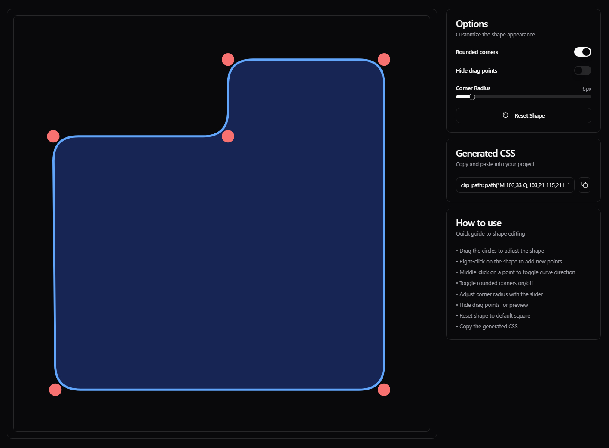
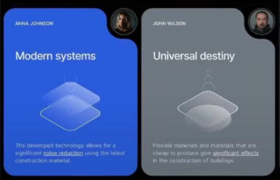

<h1 align="center">
  <br>
    Shape Editor
<br>
</h1>

<p align="center">
<a href="https://github.com/ajr-dev/shape-editor/fork" target="blank">

</a>
<a href="https://github.com/ajr-dev/shape-editor/stargazers" target="blank">

</a>
<a href="https://github.com/ajr-dev/shape-editor/pulls" target="blank">

</a>
</p>

A basic modern, interactive tool for creating and editing CSS clip-path shapes with smooth corners and precise control.

## 🚀 Features

- Interactive shape editing with draggable points
- Smooth corner rounding with adjustable radius
- Dark/Light mode support
- Copy-to-clipboard CSS output
- Toggle snap to grid for precise alignment
- Responsive design (although mobile functionality not supported)

## Getting Started

### Prerequisites

- Node.js 18+ and npm

### Installation

1. Clone the repository:
```bash
git clone https://github.com/ajr-dev/shape-editor.git
cd shape-editor
npm install
```

2. Run the project:
```bash
npm run dev
```


## Tech Stack

- **Next.js**: A React framework for server-side rendering and generating static websites.
- **Tailwind CSS**: A utility-first CSS framework for rapid UI development.
- **shadcn/ui**: A collection of accessible and customizable UI components.

## Screenshots

### Editor Interface


### Example Use Case


## 💻 Usage

1. Open the Shape Editor in your browser.
2. Use the draggable points to adjust the shape.
3. Modify the corner radius for smooth rounding.
5. Copy the generated CSS clip-path code to your clipboard.

## Citation

If you utilize this repository, data in a downstream project, please consider citing it with:

```
@misc{shape-editor,
  author = {AJR},
  title = {A simple tool to make modern clip paths for your designs.},
  year = {2025},
  publisher = {GitHub},
  journal = {GitHub repository},
  howpublished = {\url{https://github.com/ajr-dev/shape-editor}},
```

## 🌟 Star history

[](https://star-history.com/#ajr-dev/shape-editor&Date)

## License

[MIT License](LICENSE)

## 🤗 Contributors

This is a community project, a special thanks to our contributors! 🤗

<a href="https://github.com/ajr-dev/shape-editor/graphs/contributors">
  
</a>